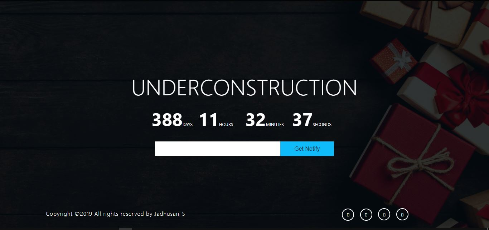
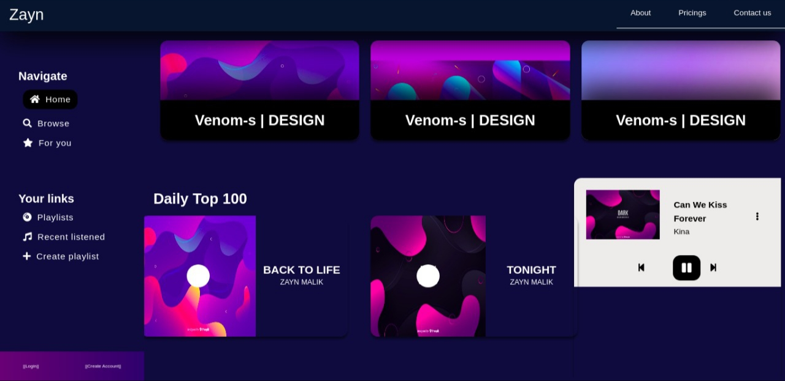
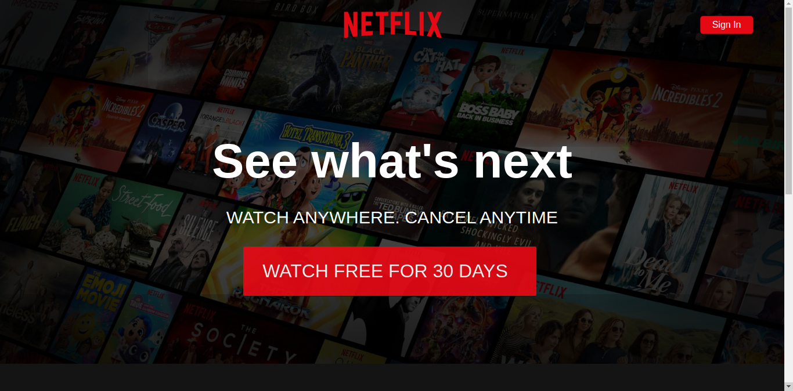

# FrontEnd-Stack

## Contact-LandingPage
 A Responsive Contact Page-template (Bootstrap | HTM | CSS).

### Responsive for devices
Minimal and responsive contact page template 
Design With HTML|CSS|BOOTSTRAP 

### Created With:
  | `1. Html`       |
  | `2. Css`        | 
  | `3. Js`         |
  | `4. And Images` |

### Final!

---------------------------------------------------------------------------------------------------------------------------------- 

# Landing-Page
A Landing Page! Using Html/Css (Under-construction View)
Under-Construction of A Webpage

### Created With:
  | `1. Html`       |
  | `2. Css`        | 
  | `3. Js`         |
  | `4. And Images` |

### Final

---------------------------------------------------------------------------------------------------------------------------------- 
# Music-Web-Player
A Frontend-Design For a Music-web-player   

    Priority was the Design.

### Created With:
  | `1. Html`       |
  | `2. Css`        | 
  | `3. Sass`       |

### Final!

---------------------------------------------------------------------------------------------------------------------------------- 

# Netflix-Mockup
This is a NETFLIX-Mock up page. Redesign With HTML|CSS|JS

### Idea
An Idea, How Netflix would be design. 
Used NETFLIX https://www.netflix.com/ Mock up To Redesign! 

### Created With:
  | `1. Html`       |
  | `2. Css`        | 
  | `3. Js`         |

### Final!
  

